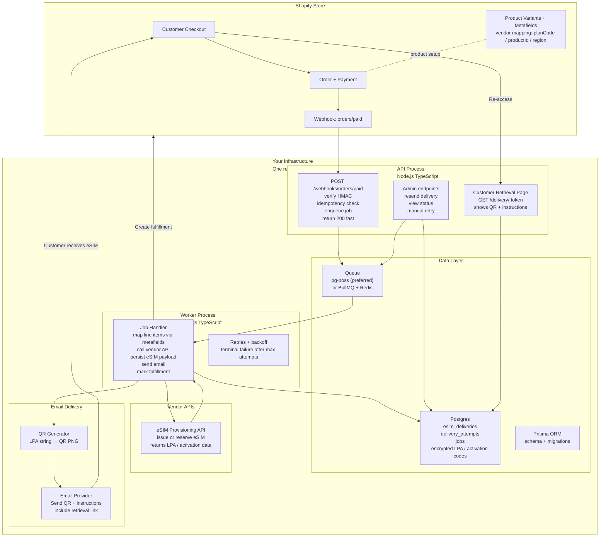

```mermaid
graph TB
  %% Shopify eSIM Fulfillment - MVP Architecture

  subgraph Shopify["Shopify Store"]
    C["Customer Checkout"]
    O["Order + Payment"]
    W["Webhook: orders/paid"]
    M["Product Variants + Metafields<br/>vendor mapping: planCode / productId / region"]
  end

  subgraph YourPlatform["Your Infrastructure<br/>One repo, two processes"]
    direction TB

    subgraph API["API Process<br/>Node.js TypeScript<br/>Fastify or Express"]
      WH["POST /webhooks/orders/paid<br/>verify HMAC<br/>idempotency check<br/>enqueue job<br/>return 200 fast"]
      ADM["Admin endpoints<br/>resend delivery<br/>view status<br/>manual retry"]
      DL["Customer Retrieval Page<br/>GET /delivery/:token<br/>shows QR + instructions"]
    end

    subgraph Worker["Worker Process<br/>Node.js TypeScript"]
      JH["Job Handler<br/>map line items via metafields<br/>call vendor API<br/>persist eSIM payload<br/>send email<br/>mark fulfillment"]
      RETRY["Retries + backoff<br/>terminal failure after max attempts"]
    end

    subgraph Data["Data Layer"]
      PG["Postgres<br/>esim_deliveries<br/>delivery_attempts<br/>jobs<br/>encrypted LPA / activation codes"]
      Q["Queue<br/>pg-boss (preferred)<br/>or BullMQ + Redis"]
      PR["Prisma ORM<br/>schema + migrations"]
    end

    subgraph Vendor["Vendor APIs"]
      VAPI["eSIM Provisioning API<br/>issue or reserve eSIM<br/>returns LPA / activation data"]
    end

    subgraph Mail["Email Delivery"]
      ESP["Email Provider<br/>Send QR + instructions<br/>include retrieval link"]
      QR["QR Generator<br/>LPA string → QR PNG"]
    end
  end

  %% Flows
  C --> O --> W --> WH
  M -. product setup .- O

  WH --> Q --> JH
  JH --> VAPI --> JH
  JH --> PG
  JH --> QR --> ESP
  JH -->|"Create fulfillment"| Shopify

  ADM --> PG
  ADM --> Q

  ESP -->|"Customer receives eSIM"| C
  C -->|"Re-access"| DL
  DL --> PG
```
