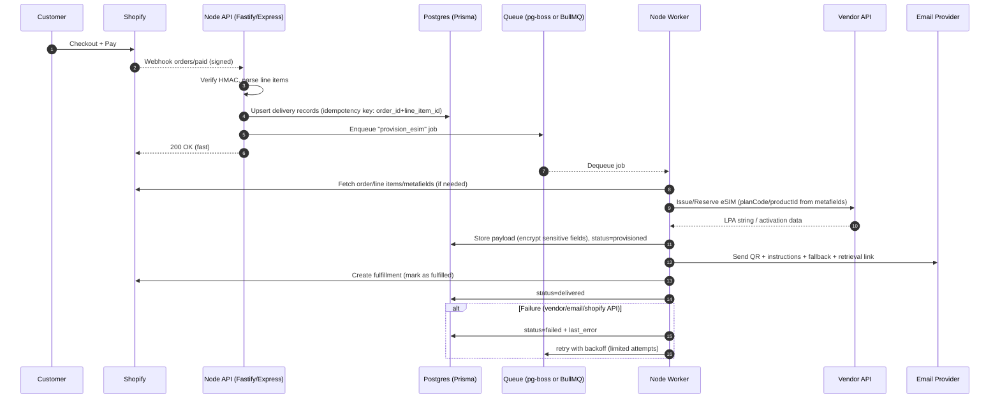

```mermaid
sequenceDiagram
  autonumber
  participant Customer
  participant Shopify
  participant API as Node API (Fastify/Express)
  participant DB as Postgres (Prisma)
  participant Queue as Queue (pg-boss or BullMQ)
  participant Worker as Node Worker
  participant Vendor as Vendor API
  participant Email as Email Provider

  Customer->>Shopify: Checkout + Pay
  Shopify-->>API: Webhook orders/paid (signed)
  API->>API: Verify HMAC, parse line items
  API->>DB: Upsert delivery records (idempotency key: order_id+line_item_id)
  API->>Queue: Enqueue "provision_esim" job
  API-->>Shopify: 200 OK (fast)

  Queue-->>Worker: Dequeue job
  Worker->>Shopify: Fetch order/line items/metafields (if needed)
  Worker->>Vendor: Issue/Reserve eSIM (planCode/productId from metafields)
  Vendor-->>Worker: LPA string / activation data
  Worker->>DB: Store payload (encrypt sensitive fields), status=provisioned
  Worker->>Email: Send QR + instructions + fallback + retrieval link
  Worker->>Shopify: Create fulfillment (mark as fulfilled)
  Worker->>DB: status=delivered

  alt Failure (vendor/email/shopify API)
    Worker->>DB: status=failed + last_error
    Worker->>Queue: retry with backoff (limited attempts)
  end
```
